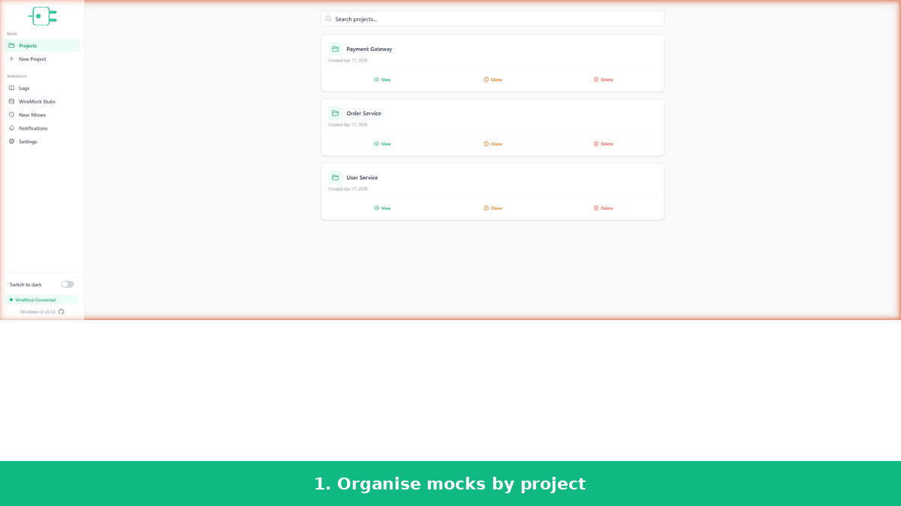
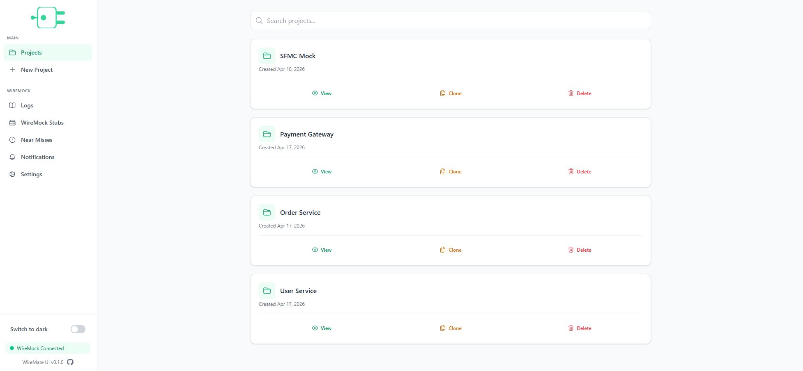
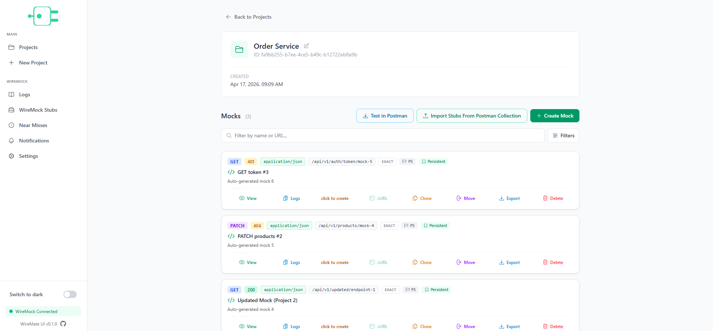
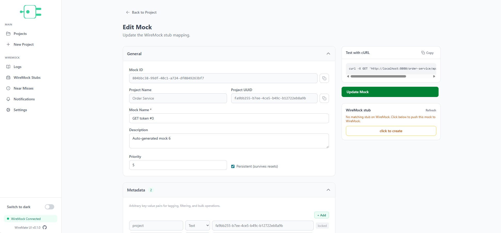
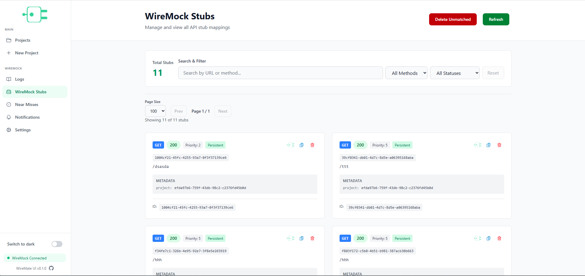
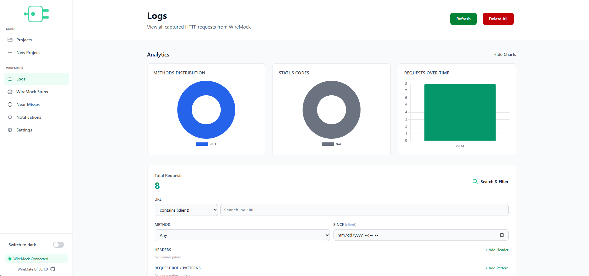
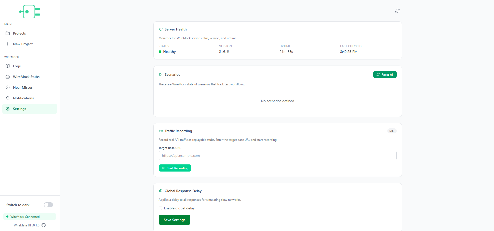

<p align="center">
  
</p>

<p align="center">
  <strong>A visual backoffice for <a href="https://wiremock.org/">WireMock</a>.</strong><br>
  Design, persist, and publish WireMock stubs from a clean UI — no hand-crafted JSON required.
</p>

<p align="center">
  
  
  
  
  
  
  
</p>

<p align="center">
  
</p>

## What is WireMate?

WireMate is the UI layer that teams keep wishing WireMock came with. Instead of editing JSON stub files by hand or juggling one-off admin scripts, engineers and QA testers work inside a single web app where every mock has a name, a description, a history, and a one-click publish button.

Every stub is persisted to PostgreSQL and grouped into **projects**, so a "Payment Gateway" mock set and an "Order Service" mock set never collide. From the same UI, you can **browse live WireMock stubs**, **search the request journal** with analytics charts, **reset scenarios**, and **record real API traffic** back into reusable mocks.

The goal is simple: turn WireMock from a developer-only CLI tool into a shared backoffice that the whole team — backend, QA, integrations — can use to spin up reliable test environments in seconds.

### Who it's for

- **Backend engineers** who want to stop maintaining stub JSON in a shared Postman collection.
- **QA and integration testers** who need to fake upstream services on demand without touching code.
- **Teams running multiple test environments** where WireMock needs to be reset, re-seeded, or mirrored from project to project.

### What makes it different

- **Everything is persisted.** Unlike a bare WireMock server, your stubs survive restarts and are versioned in Postgres.
- **Projects, not folders.** Organise stubs the way you think about them — by service, by feature, by team.
- **Sync awareness.** A background task continuously diffs your database against the live WireMock server and surfaces drift in the notifications panel.
- **One place for everything.** Mocks, active stubs, request journal, near misses, scenarios, and server health all live under the same nav.

## Features

- **Visual Mock Builder** — Create request/response mappings through an intuitive form: methods, URLs, headers, JSON bodies, delays, and descriptions.
- **Project Management** — Organise mocks into projects with search and filtering across your entire workspace.
- **WireMock Stubs Viewer** — Browse all active stub mappings on your WireMock server. Filter by method, search by URL, and preview responses in real time.
- **Request Journal with Analytics** — Inspect every request WireMock receives (matched and unmatched) with live charts for method distribution, status codes, and request volume over time.
- **State Control** — Manage WireMock scenarios, set global response delays, monitor server health, and perform admin operations from a single dashboard.
- **Traffic Recording** — Point WireMate at a real API and record traffic straight back into replayable stubs.
- **Clone & Move** — Duplicate any mock or project in one click, or transfer mocks between projects as your needs evolve.
- **Postman Import / JSON Export** — Bring existing collections in and export any project for versioning or sharing.
- **Sync Delta Notifications** — A background task detects differences between the database and WireMock and surfaces them in-app.
- **One-Click Publish** — Push stubs directly to any WireMock server. Go from draft to live mock in seconds.
- **Dark & Light Theme** — Switch between dark and light modes; every view adapts seamlessly.
- **Persistent Storage** — All mappings are persisted to PostgreSQL. Never lose a stub.
- **Docker-Ready** — Spin up the entire stack with Docker Compose in one command.

## Screenshots

<table>
  <tr>
    <td width="50%"><br><sub><b>Projects</b> — everything is scoped to a project you own.</sub></td>
    <td width="50%"><br><sub><b>Project detail</b> — all mocks in one place, with per-mock logs, clone, and move.</sub></td>
  </tr>
  <tr>
    <td><br><sub><b>Mock editor</b> — guided form for request matching, response, headers, and delays.</sub></td>
    <td><br><sub><b>Stubs viewer</b> — live mirror of what's actually running on the WireMock server.</sub></td>
  </tr>
  <tr>
    <td><br><sub><b>Request journal</b> — matched vs unmatched, method + status breakdowns, volume over time.</sub></td>
    <td><br><sub><b>State control</b> — scenarios, traffic recording, global delays, server health.</sub></td>
  </tr>
</table>

## How It Works

1. **Create a project** — Group your stubs by project. Stay organised from day one.
2. **Build your stubs** — Use the UI to define requests, responses, delays, and headers.
3. **Publish to WireMock** — Publish instantly. All stubs are persisted in the database.
4. **Monitor & debug** — Search through the request journal to inspect incoming requests and debug your stubs.

## Tech Stack

**Backend** — Java 25, Spring Boot 4.0.6, Spring Data JPA, PostgreSQL 17 (JSONB), Maven

**Frontend** — Vue 3.5, TypeScript 5.9, Vite 8, Tailwind CSS 4, mgv-backoffice component library

**Infrastructure** — Docker & Docker Compose, Nginx (production), WireMock 3.6.0

## Getting Started

### Prerequisites

- Docker & Docker Compose
- (For local dev) Java 25+, Maven 3.9+, Node.js 18+

### Run with Docker Compose

The compose file pulls the backend and UI images from GHCR (built by the CI pipeline — see [Continuous Delivery](#continuous-delivery)), so you don't need to build anything locally.

```bash
git clone https://github.com/mixaverros88/WireMate.git
cd WireMate

# For private images, sign in first:
#   echo "$GITHUB_TOKEN" | docker login ghcr.io -u <your-user> --password-stdin
# For public images this step can be skipped.

docker compose pull
docker compose up -d
```

This starts PostgreSQL on port 5432, WireMock on port 8080, the backend on port 8081, and the UI on port 3000 (served via Nginx). The compose file pins both images to `ghcr.io/mixaverros88/wiremate-{service,ui}:latest` — edit `docker-compose.yml` directly if you need to pin to a specific commit (see [Continuous Delivery](#continuous-delivery) for the tag scheme).

### Run Locally

**Start the infrastructure:**

```bash
docker compose up postgres wiremock
```

**Start the backend:**

```bash
cd service
mvn spring-boot:run
```

The API will be available at `http://localhost:8081`.

**Start the frontend:**

```bash
cd UI
npm install
npm run dev
```

The UI will be available at `http://localhost:5173`. The Vite dev server proxies `/api` requests to the backend automatically.

## Configuration

The backend reads configuration from `service/src/main/resources/application.properties` and supports environment variable overrides:

| Variable            | Default                   | Description                  |
|---------------------|---------------------------|------------------------------|
| `DB_HOST`           | `localhost`               | PostgreSQL host              |
| `DB_PORT`           | `5432`                    | PostgreSQL port              |
| `DB_NAME`           | `wiremate`                | Database name                |
| `DB_USER`           | `wiremate`                | Database user                |
| `DB_PASSWORD`       | `wiremate`                | Database password            |
| `SERVER_PORT`       | `8081`                    | Backend API port             |
| `WIREMOCK_BASE_URL` | `http://localhost:8080`   | WireMock server URL          |

## API Endpoints

### Projects

| Method   | Path                          | Description                       |
|----------|-------------------------------|-----------------------------------|
| `GET`    | `/api/projects`               | List all projects                 |
| `GET`    | `/api/projects/:id`           | Get a project with its mocks      |
| `POST`   | `/api/projects`               | Create a new project              |
| `PUT`    | `/api/projects/:id`           | Update a project                  |
| `POST`   | `/api/projects/:id/clone`     | Clone a project and its mocks     |
| `DELETE` | `/api/projects/:id`           | Delete a project                  |

### Mocks

| Method   | Path                            | Description                           |
|----------|---------------------------------|---------------------------------------|
| `POST`   | `/api/mocks`                    | Create a mock (auto-publishes)        |
| `GET`    | `/api/mocks/:id`                | Get mock details                      |
| `PUT`    | `/api/mocks/:id`                | Update a mock                         |
| `POST`   | `/api/mocks/:id/clone`          | Clone a mock                          |
| `PUT`    | `/api/mocks/:id/move`           | Move a mock to another project        |
| `POST`   | `/api/mocks/:id/republish`      | Re-publish a mock to WireMock         |
| `DELETE` | `/api/mocks/:id`                | Delete a mock                         |

> Mocks belonging to a project are returned by `GET /api/projects/:id` (which embeds them in the project response). There is no separate "list mocks for project" endpoint.

### Backoffice

| Method | Path                              | Description                  |
|--------|-----------------------------------|------------------------------|
| `GET`  | `/api/backoffice/notifications`   | Retrieve system notifications |

## Project Structure

```
WireMate/
├── service/                              # Spring Boot backend
│   └── src/main/java/com/wire/mate/service/
│       ├── config/                       # REST client / app configuration
│       ├── controller/                   # REST controllers (Project, Mock, Backoffice)
│       ├── service/                      # Domain services
│       ├── logic/                        # WireMock integration logic
│       ├── gateway/                      # WireMock REST client
│       ├── entity/                       # JPA entities (JSONB columns)
│       ├── dto/                          # Request/response records
│       ├── repository/                   # Spring Data repositories
│       ├── exception/                    # Global error handling
│       ├── task/                         # Scheduled tasks (sync-delta detection)
│       └── util/                         # Shared utilities
├── UI/                                   # Vue 3 frontend
│   └── src/
│       ├── views/                        # Page components
│       ├── components/                   # Reusable components (sidebar, modals, …)
│       ├── composables/                  # Vue composables (theme)
│       ├── services/                     # API clients (mock, project, journal, stub, …)
│       ├── types/                        # TypeScript types
│       └── router/                       # Vue Router config
├── .github/workflows/                    # CI / CD (docker-publish.yml)
├── docs/                                 # Logo, demo GIF, screenshots
├── docker-compose.yml
├── wiremock-api-documentation.html
└── stub-properties-documentation.html
```

## Continuous Delivery

Every commit to `main` triggers the [`docker-publish`](.github/workflows/docker-publish.yml) workflow, which builds and pushes multi-arch (`linux/amd64` + `linux/arm64`) images for both components to GitHub Container Registry.

Pull the latest images:

```bash
docker pull ghcr.io/<owner>/wiremate-service:latest
docker pull ghcr.io/<owner>/wiremate-ui:latest
```

Tag scheme:

- `:latest` — rolling tag tracking `main`.
- `:main-<short-sha>` — immutable, traceable per-commit reference.
- `:sha-<short-sha>` — convenience tag for pinning by SHA only.

The workflow uses the built-in `GITHUB_TOKEN` — no extra secrets are required. The repository does need **Settings → Actions → General → Workflow permissions** set to *Read and write permissions* (or the workflow's `packages: write` permission granted), and the resulting packages default to private; make them public from the package page if you want pulls without auth.

## License

This project is not currently published under a specific license. Contact the maintainers for usage terms.
